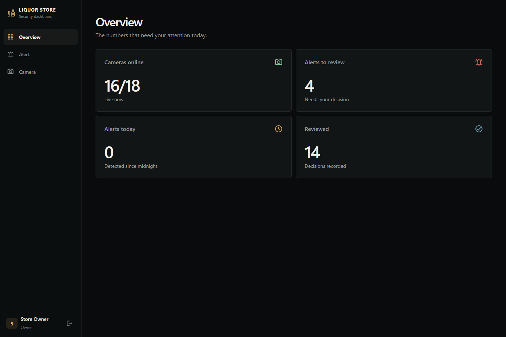
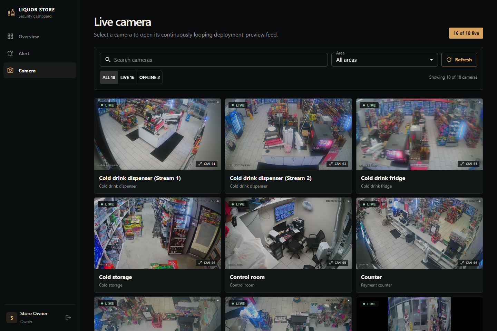
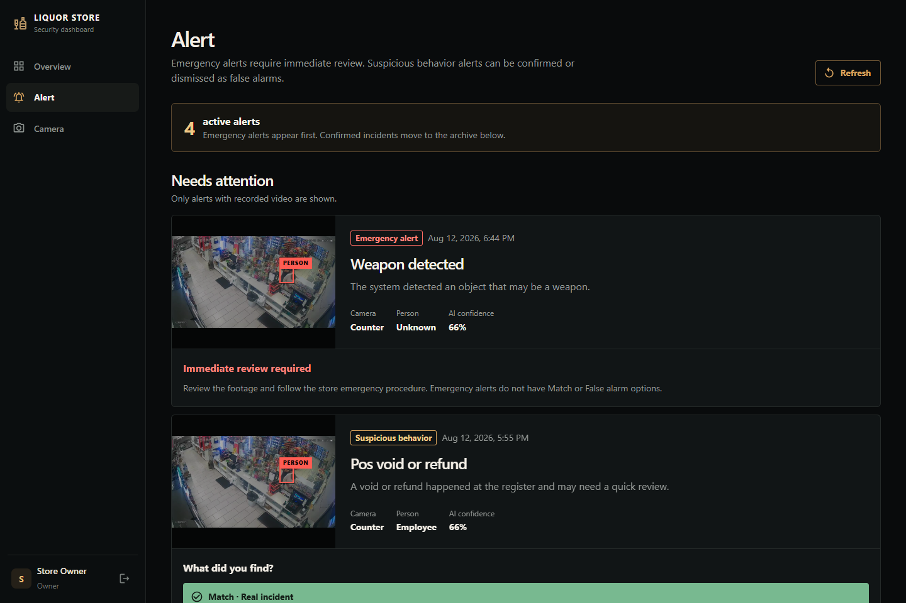

# Liquor Store Security

Monorepo for the liquor-store security dashboard and API.

## Applications

- `apps/web`: React, Vite and Material UI owner dashboard.
- `apps/api-go`: active Go backend using `net/http`, pgx, JWT and Argon2id.

## Interface

### Overview



### Camera monitoring



### Alert review



## Run locally

```bash
pnpm install
pnpm dev
```

- Web app: `http://localhost:5173`
- API: `http://localhost:3000/api/v1`
- Swagger UI: `http://localhost:3000/docs`

Go 1.26.8 or newer is required. `go.mod` enforces the patched minimum; the PowerShell scripts allow automatic toolchain selection and can use a portable SDK in `.tools/go-1.26.8` when Go is not installed system-wide.

## Design artifacts

- [Database design](docs/database-design.md)
- [REST API contract](docs/api-contract.md)
- [Authentication and authorization design](docs/auth-design.md)
- [Near-real-time streaming design](docs/streaming-design.md)
- [Security hardening and deployment checklist](docs/security-hardening.md)
- [Go migration](apps/api-go/internal/migrations/sql/20260802000000_init.sql)

Copy `apps/api-go/.env.example` to `apps/api-go/.env`, set the Neon URLs and secrets, then run:

```bash
pnpm db:migrate
pnpm db:seed
```

`pnpm db:seed` is safe to run repeatedly. It prepares the default store with
18 record-backed camera feeds, 6 detection zones, and 20 video-backed alerts
for the Overview, Camera, and Alert screens. Twelve alerts remain in the owner
review queue, while Kitchen and Whole store top view (Stream 2) are initialized
with offline status. Existing rows are updated by stable references instead of
being duplicated. Set `SEED_STORE_CODE` to target a different store.

The included CCTV media supports camera playback, alert review, and tracked
person overlays. Per-frame normalized bounding boxes are generated with YOLO26n
and ByteTrack and synchronized with video playback in the browser. To regenerate
the tracking metadata, install `scripts/requirements-tracking.txt` and run
`scripts/generate-alert-tracks.py`.
