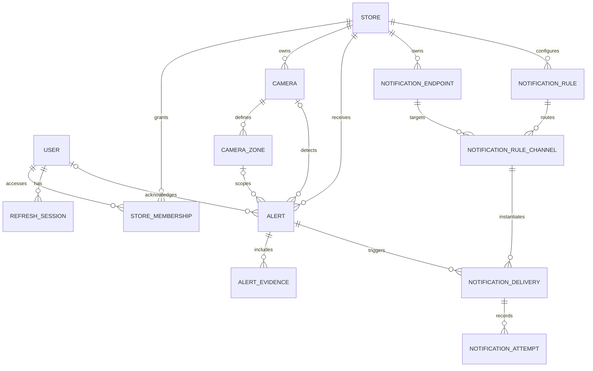

# Database design

## Technology and connection policy

The database is PostgreSQL on Neon. The Go backend uses embedded SQL migrations through `cmd/migrate`.

- `DIRECT_URL` is the direct Neon endpoint and is used by the Go migration command.
- `DATABASE_URL` is the pooled Neon endpoint for API runtime traffic.
- Camera credentials and raw RTSP URLs are never persisted in this database. `Camera.streamGatewayRef` identifies a record in the future streaming gateway / secret store.
- Video files are object-storage assets. `AlertEvidence.storageKey` is persisted; signed playback URLs are generated only when an authorized user requests them.
- The gateway ingests live camera streams continuously; see the [streaming design](streaming-design.md).

## Entity relationships

## Key integrity rules

- A user may access a store only through `StoreMembership`; the role is scoped to that store.
- `StoreMembership(userId, storeId)` is unique.
- AI retry events are idempotent through the unique, nullable `Alert.sourceEventId`.
- Alert query indexes favor the dashboard filters: store, status and detection time.
- `CameraZone.polygon` stores normalized image coordinates; `dwellThresholdSeconds` turns the high-value-zone requirement into a configurable rule.
- A cashier camera is calibrated with two `CASHIER` zones: the inner side has `expectedPersonCategory=EMPLOYEE`; the customer-facing outer side has `expectedPersonCategory=CUSTOMER`. This is spatial classification, not facial identification.
- Every alert preserves the AI's `subjectPersonCategory` (`EMPLOYEE`, `CUSTOMER` or `UNKNOWN`) so downstream triage can apply the correct behavior rule.
- A store can have many cameras. Zones are calibrated independently for each camera angle; `Alert.correlationId` groups observations of one incident from multiple cameras while preserving each camera's evidence.
- Refresh tokens are stored only as a hash and can be individually revoked.
- Notification credentials are never stored directly. `NotificationEndpoint.credentialRef` points to the deployment secret manager, while delivery payloads contain only owner-safe alert context and storage keys - never signed URLs that could expire before a retry.
- ALERT-kind notification deduplication is incident-scoped: `NotificationDelivery.dedupeKey` is `alert:{correlationId|alertId}:{ruleId}:{endpointId}` without the template version, so one correlated incident produces one delivery per route even when observed by several cameras or when template configuration changes. `templateVersion` remains an immutable snapshot on each delivery for rendering and audit. Each provider request is retained as an immutable `NotificationAttempt` audit row, and the delivery guarantee is at-least-once: a provider-accepted message can still be re-sent after a worker crash.
- Emergency rules keep `cooldownSeconds = 0`, so two independent emergency incidents always create two deliveries; duplicate protection for one incident comes from the correlationId/alertId-based `dedupeKey`. Cooldown is optional and only for future non-emergency rules, and when set it must suppress by an explicit event fingerprint scope, never bare store + rule.
- Deliveries snapshot the route (`provider`, `priority`, `fallbackDelaySeconds`, `templateVersion`) at creation time, so later configuration changes cannot distort queued or historical deliveries. A database check constraint ties the lease to the status: `PROCESSING` requires `lockedAt` + `lockedUntil > lockedAt`, any other status requires both NULL, and every transition out of `PROCESSING` clears them. A `PROCESSING` row past its lease returns to `RETRY_SCHEDULED`.
- Notification tables prevent cross-store links with composite foreign keys on `(id, storeId)` unique pairs instead of application-only validation; resources with delivery history are soft-disabled rather than deleted so audit history stays intact. The alert foreign key on deliveries is `ON DELETE RESTRICT`: an alert that already produced notifications cannot be hard-deleted - hide or archive it via alert status instead.
- `notification_video_links` stores only a SHA-256 digest of each 256-bit opaque review token plus its exact store/alert/evidence scope, optional delivery, expiry/revocation state and access counters. The bearer token and `AlertEvidence.storageKey` never appear in delivery payloads or API audit responses.
- Expired or revoked review-link rows are retained for 24 hours and then removed in bounded batches by the notification worker; this maintenance does not delete alert evidence.
- `notification_provider_events` stores idempotent WhatsApp delivery receipts keyed by provider message ID, status and provider timestamp. It retains only `SENT`/`DELIVERED`/`READ`/`FAILED`, the timestamp and a stable numeric error code; webhook bodies, phone numbers and provider descriptions are deliberately excluded. Receipt summary columns on `notification_deliveries` are updated monotonically so late events cannot downgrade `READ` or overwrite a delivered message with `FAILED`. A valid asynchronous failure before delivery/read also marks the route failed and reactivates the next fallback delivery.

The executable migrations live in [`apps/api-go/internal/migrations/sql`](../apps/api-go/internal/migrations/sql). They run in filename order and are recorded in `go_schema_migrations`. On an existing database created by Prisma, `pnpm db:migrate` records the initial schema as the Go migration baseline without recreating tables or data, then applies later migrations normally (`20260802000000_init.sql`, `20260822000000_notifications.sql`, then `20260827000000_notification_delivery_runtime.sql`).

The Telegram-first notification flow, retry policy and planned owner API are specified in [notification-design.md](notification-design.md).
