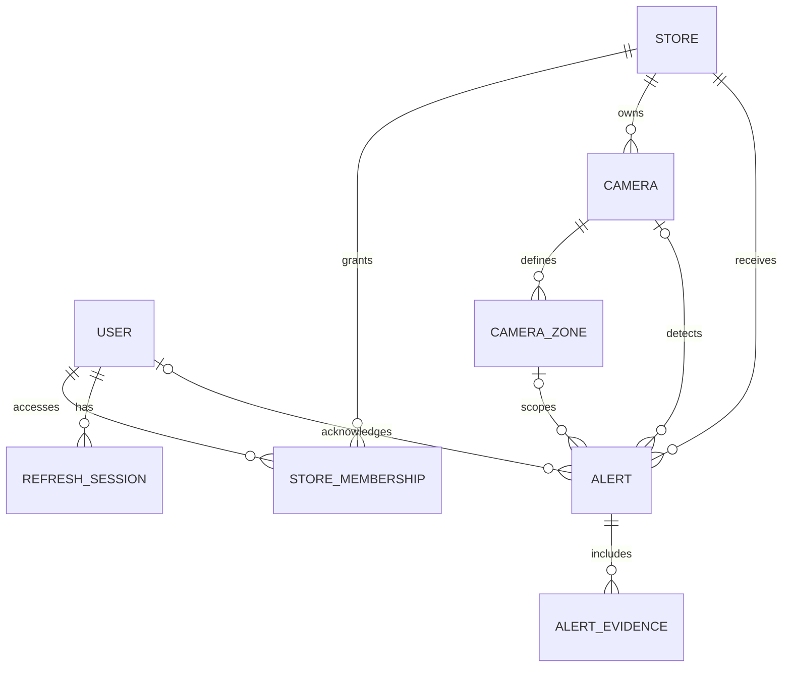

# Database design

## Technology and connection policy

The database is PostgreSQL on Neon. The Go backend uses embedded SQL migrations through `cmd/migrate`.

- `DIRECT_URL` is the direct Neon endpoint and is used by the Go migration command.
- `DATABASE_URL` is the pooled Neon endpoint for API runtime traffic.
- Camera credentials and raw RTSP URLs are never persisted in this database. `Camera.streamGatewayRef` identifies a record in the future streaming gateway / secret store.
- Video files are object-storage assets. `AlertEvidence.storageKey` is persisted; signed playback URLs are generated only when an authorized user requests them.
- The gateway ingests live camera streams continuously; see the [streaming design](streaming-design.md).

## Entity relationships

## Key integrity rules

- A user may access a store only through `StoreMembership`; the role is scoped to that store.
- `StoreMembership(userId, storeId)` is unique.
- AI retry events are idempotent through the unique, nullable `Alert.sourceEventId`.
- Alert query indexes favor the dashboard filters: store, status and detection time.
- `CameraZone.polygon` stores normalized image coordinates; `dwellThresholdSeconds` turns the high-value-zone requirement into a configurable rule.
- A cashier camera is calibrated with two `CASHIER` zones: the inner side has `expectedPersonCategory=EMPLOYEE`; the customer-facing outer side has `expectedPersonCategory=CUSTOMER`. This is spatial classification, not facial identification.
- Every alert preserves the AI's `subjectPersonCategory` (`EMPLOYEE`, `CUSTOMER` or `UNKNOWN`) so downstream triage can apply the correct behavior rule.
- A store can have many cameras. Zones are calibrated independently for each camera angle; `Alert.correlationId` groups observations of one incident from multiple cameras while preserving each camera's evidence.
- Refresh tokens are stored only as a hash and can be individually revoked.

The executable initial migration is [20260802000000_init.sql](../apps/api-go/internal/migrations/sql/20260802000000_init.sql). On an existing database created by Prisma, `pnpm db:migrate` records that schema as the Go migration baseline without recreating tables or data.
