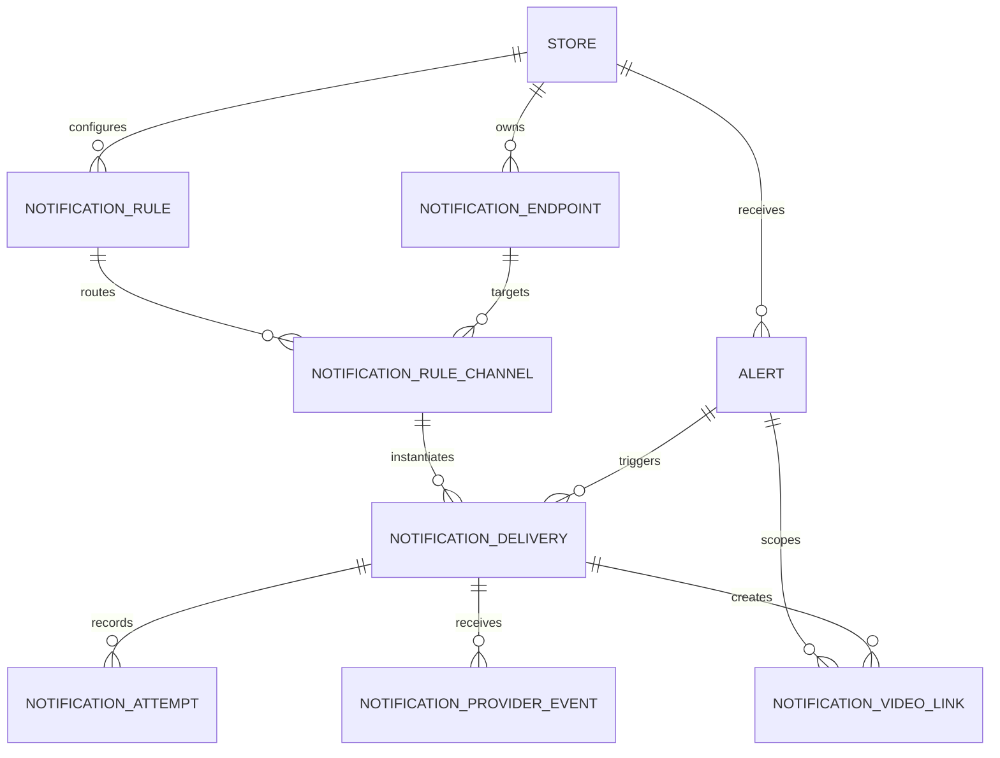

# Notification flow and database design

## Scope

Telegram is the priority-1 channel and WhatsApp is the priority-2 fallback. Both provider adapters are implemented and registered in the runtime worker; provider calls remain disabled unless `NOTIFICATION_WORKER_ENABLED=true`. The approved WhatsApp template and parameter contract are recorded in [whatsapp-emergency-template.md](whatsapp-emergency-template.md).

Notifications are sent only for emergency rules configured by the store owner. The initial rule matches `CRITICAL` alerts with `alertTypes = ['WEAPON_DETECTED']` and `cooldownSeconds = 0` (the violence-or-weapon folder). Suspicious-behavior alerts stay on the dashboard only; they never enqueue a delivery unless a future owner-created rule explicitly opts them in.

## End-to-end flow

```mermaid
sequenceDiagram
  participant AI as AI service
  participant API as Go API
  participant DB as PostgreSQL (outbox)
  participant Worker as Notification worker
  participant TG as Telegram Bot API
  participant Owner as Store owner

  AI->>API: Create idempotent alert
  API->>DB: One transaction: insert alert + all route deliveries
  Note over DB: Telegram row PENDING, fallback rows WAITING_FALLBACK

  loop Worker poll
    Worker->>DB: Claim due PENDING/RETRY_SCHEDULED row (FOR UPDATE SKIP LOCKED)
    DB-->>Worker: Row locked as PROCESSING with lockedAt + lockedUntil lease

    alt Telegram accepts
      Worker->>TG: sendMessage (short-lived evidence review URL built now)
      TG-->>Worker: message_id
      Worker->>DB: SENT + SUCCEEDED attempt; sibling WAITING_FALLBACK -> CANCELLED
      TG->>Owner: Possible emergency, human review required
    else Transient error (429 / 5xx / network) and attempts remain
      TG-->>Worker: Error
      Worker->>DB: FAILED attempt + RETRY_SCHEDULED with backoff availableAt
    else Permanent error or maxAttempts exhausted
      TG-->>Worker: Invalid chat / credential / attempts exhausted
      Worker->>DB: FAILED; activate next WAITING_FALLBACK after its snapshot fallbackDelaySeconds
    else Worker crash mid-send
      Note over DB: Recovery pass: PROCESSING row with expired lockedUntil<br/>is reset to RETRY_SCHEDULED
    end
  end
```

## Delivery lifecycle

```mermaid
stateDiagram-v2
  [*] --> WAITING_FALLBACK : lower-priority route enqueued in alert transaction
  [*] --> PENDING : priority-1 route enqueued in alert transaction
  WAITING_FALLBACK --> PENDING : higher priority FAILED and fallbackDelaySeconds elapsed
  WAITING_FALLBACK --> CANCELLED : sibling route reached SENT
  PENDING --> PROCESSING : worker claims row, sets lockedAt + lockedUntil
  PROCESSING --> SENT : provider accepted; lease cleared
  PROCESSING --> RETRY_SCHEDULED : transient failure with attempts remaining; lease cleared
  PROCESSING --> RETRY_SCHEDULED : lease recovery (lockedUntil expired); lease cleared
  PROCESSING --> FAILED : permanent error or last attempt failed; lease cleared
  RETRY_SCHEDULED --> PROCESSING : availableAt reached and worker claims a new lease
  FAILED --> [*]
  SENT --> [*]
  CANCELLED --> [*]
```



Every edge leaving `PROCESSING` clears `lockedAt`/`lockedUntil` atomically, as required by the lease-status check constraint.

| Status | Meaning |
| --- | --- |
| `WAITING_FALLBACK` | Enqueued behind a higher priority; not eligible for pickup until activated. |
| `PENDING` | Eligible for pickup once `availableAt <= now()`. |
| `PROCESSING` | Claimed by a worker under a lease (`lockedAt`, `lockedUntil`). |
| `RETRY_SCHEDULED` | Transient failure; retry after backoff at `availableAt`. Also the landing state for recovered leases because the original attempt may have succeeded. |
| `SENT` | Terminal success; provider confirmed the message. |
| `FAILED` | Terminal failure (permanent error or `maxAttempts` exhausted); triggers fallback activation. |
| `CANCELLED` | Terminal suppression: a sibling route was `SENT`, or an owner disabled the route before sending. |

Lease columns are bound to the status by a database check constraint: `PROCESSING` requires `lockedAt` and `lockedUntil` with `lockedUntil > lockedAt`; every other status requires both to be NULL. Each transition out of `PROCESSING` - to `SENT`, `FAILED`, `RETRY_SCHEDULED` or `CANCELLED` - must clear the lease in the same update, so no terminal or retry row can ever appear locked.

## Rule matching semantics

A rule matches an alert when **both** conditions hold (AND):

1. Severity rank of `alert.severity` >= rank of `rule.minimumSeverity` (`LOW < MEDIUM < HIGH < CRITICAL`).
2. `rule.alertTypes` contains `alert.type`. An empty array means every alert type that passes the severity condition.

### Cooldown is opt-in, never for emergency rules

- `cooldownSeconds` defaults to `0`, and the initial emergency rule keeps it at `0`: an independent emergency must never be suppressed because a previous one happened minutes earlier. Two independent emergency incidents always produce two distinct deliveries.
- Duplicate protection for one incident comes exclusively from the incident-scoped `dedupeKey` (`alert:{correlationId|alertId}:{ruleId}:{endpointId}` - correlationId preferred when present, alertId otherwise) - not from cooldown. TemplateVersion is not part of dedupe identity; it remains only an immutable delivery snapshot for rendering and audit.
- Cooldown exists only as an optional tool for future non-emergency rules. When it is greater than `0`, suppression must be evaluated against an explicitly defined event fingerprint scope - for example `(storeId, cameraId, alertType, correlationId)` within the window - never against bare `storeId + ruleId`, which would swallow unrelated incidents.

## Outbox, dedupe and delivery guarantee

- Task 6 exposes `POST /api/v1/internal/ai/alerts` behind a dedicated constant-time-compared Bearer token. It validates the store/camera/zone scope and relative video evidence keys before writing. The generated alert UUID, evidence records and matching delivery routes are committed through one PostgreSQL transaction. Replaying `sourceEventId` returns the existing UUID and delivery set without another enqueue.
- The alert insert and all of its route deliveries commit in **one transaction** (transactional outbox). A crash can never persist an alert without its notifications or vice versa.
- ALERT-kind deduplication is **incident-scoped** and deterministic. The dedupe key is `alert:{correlationId|alertId}:{ruleId}:{endpointId}` - correlationId preferred when present, alertId otherwise. TemplateVersion is deliberately **not** part of the identity: it stays an immutable snapshot on each delivery for rendering and audit only, so changing template configuration can never accidentally notify the owner twice for the same physical incident.
- Consequences of this identity:
  - Two alerts sharing a `correlationId` (one incident seen by several cameras) produce **one** delivery per rule+endpoint; the first observation wins and later observations of the same incident are skipped.
  - A changed `templateVersion` never creates a second delivery for the same incident.
  - Distinct `correlationId`s always create independent deliveries.
  - Without a correlationId, distinct `alertId`s remain independent.
- `dedupeKey` uniqueness makes duplicate enqueues fail harmlessly via `ON CONFLICT DO NOTHING`; the pre-existing `(alertId, ruleId, endpointId)` index stays in place as defense in depth without changing these semantics. No migration was required for this identity change.
- TEST kind keeps its own idempotency key `test:{endpointId}:{requestId}`.
- Camera observations remain separate alerts with their own evidence for dashboard review; only owner notification dedupe is incident-scoped. Retries of the same AI event reuse the same `sourceEventId`/`alertId`, so they never duplicate notifications either.
- **Delivery guarantee is at-least-once.** Deduplication prevents duplicate outbox creation but cannot make Telegram exactly-once: if the provider already accepted a message and the worker crashes before writing `SENT`, lease recovery re-sends and the owner may receive the message twice.
- Every provider call appends exactly one immutable `notification_attempts` row (`deliveryId`, `attemptNumber` unique). Attempts are audit records: the application never updates or deletes them, and `responseMetadata` must contain only non-sensitive provider metadata such as rate-limit headers - never tokens, credentials or message bodies with personal data.

## Route snapshot immutability

When a delivery is created it copies everything needed to send it later:

| Snapshot column | Copied from |
| --- | --- |
| `provider` | `notification_endpoints.provider` |
| `priority` | `notification_rule_channels.priority` |
| `fallbackDelaySeconds` | `notification_rule_channels.fallbackDelaySeconds` |
| `templateVersion` | template version active at enqueue time |

Later configuration edits therefore cannot corrupt historical deliveries: a queued WhatsApp fallback still uses the delay and priority captured when the alert happened. The payload likewise embeds the rendered message inputs rather than live configuration.

## Lease recovery

Each claim sets `lockedAt = now()` and `lockedUntil = now() + lease` (lease longer than the worst-case provider timeout). A recovery pass requeues rows where `status = 'PROCESSING' AND lockedUntil < now()` back to `RETRY_SCHEDULED`; the partial index on `lockedUntil` serves exactly this scan. Because the crashed attempt may have reached Telegram, recovery can produce a duplicate send - this is the accepted cost of the at-least-once guarantee above.

## Message contract

`notification_deliveries.payload` stores owner-safe render inputs only:

- alert ID, correlationId, type and severity;
- emergency title and short description;
- store, camera name and detected timestamp in the store timezone;
- subject person category when available;
- dashboard deep link to the alert;
- `evidenceId` only. Object-storage locators remain in `alert_evidence` and are never copied into the delivery payload.

The durable payload never contains storage keys, signed/expiring URLs (they would break retries), RTSP URLs, camera passwords or provider tokens. Task 5 resolves `evidenceId` server-side and generates a fresh short-lived review URL immediately before each provider attempt. The generated URL is held only in memory and `RenderPayload.ReviewURL` is excluded from JSON serialization.

The owner-facing message states that the system detected a situation that may be an emergency and asks a human to review the evidence. It must not assert that a crime definitely occurred and must never contact law enforcement automatically.

The WhatsApp provider renders the exact reviewed parameter order documented in [whatsapp-emergency-template.md](whatsapp-emergency-template.md). The active version 2 contract has a VIDEO header and a dynamic `View alert` URL button. The header receives a fresh short-lived HTTPS evidence URL immediately before each attempt; the URL is never serialized into the durable delivery payload. Version 1 is retained only to interpret immutable historical snapshots.

## Secret handling

`notification_endpoints.credentialRef` stores only a reference such as `env://WHATSAPP_ACCESS_TOKEN`. Telegram and WhatsApp access tokens live in the deployment secret manager and never appear in PostgreSQL, API responses, logs or the frontend bundle.

For a WhatsApp endpoint, `providerAccountRef` is the Meta Phone Number ID and `config.wabaId` is the WABA ID - both are identifiers, not credentials. Only the Cloud API access token and App Secret are secrets and stay in the deployment secret manager. The reviewed message copy, parameter order and owner opt-in language are frozen in [whatsapp-emergency-template.md](whatsapp-emergency-template.md).

For Telegram: `providerAccountRef` identifies the bot (for example its username), `destinationRef` is the target `chat_id`, and `config` holds non-secret options such as parse mode and whether to attach a thumbnail.

## Test messages

Owner-requested test sends do not originate from a real alert, so they are recorded as deliveries with `deliveryKind = 'TEST'`: `alertId`, `ruleId` and `ruleChannelId` are NULL (enforced by a check constraint), the endpoint is pinned, and `dedupeKey = test:{endpointId}:{requestId}` makes repeated clicks idempotent while keeping tests separate from alert history. They run through the same worker and append the same immutable attempts rows, so troubleshooting has full evidence even though no alert exists. TEST deliveries have no fallback chain. Admission is serialized across API instances by a PostgreSQL advisory transaction lock: maximum 1 new TEST per endpoint/minute, 3 per endpoint/hour, 10 per store/hour, 10 per requester/hour, and 100 globally/hour; pending caps are 1 per endpoint, 3 per store and 50 globally. An identical requestId returns its existing job without using another quota unit. Excess requests receive 429. ALERT work is selected before TEST work.

## Data model



### Table responsibilities

| Table | Responsibility |
| --- | --- |
| `notification_endpoints` | Store-scoped Telegram/WhatsApp destination and secret reference. |
| `notification_rules` | Severity and alert-type conditions (AND), cooldown and enable state. |
| `notification_rule_channels` | Ordered delivery route per rule: Telegram first, WhatsApp later. |
| `notification_deliveries` | Transactional outbox row with route snapshot, rendered payload, lease/retry state and final provider message ID. |
| `notification_attempts` | Immutable per-request provider log. |
| `notification_provider_events` | Idempotent WhatsApp `sent`/`delivered`/`read`/`failed` receipts linked by provider message ID; raw webhook bodies are not stored. |
| `notification_video_links` | SHA-256 hash of an opaque, short-lived bearer token scoped to one alert evidence object; raw tokens and storage keys are never stored here. |

### Store isolation enforced by the database

Cross-store links are prevented by composite foreign keys, not application checks alone:

- Parent tables carry `UNIQUE (id, storeId)` (`alerts`, `notification_rules`, `notification_endpoints`, `notification_rule_channels`).
- `notification_rule_channels (ruleId, storeId)` and `(endpointId, storeId)` reference those keys, so a channel can only pair a rule and an endpoint from the same store.
- Every delivery carries `storeId` and references `(alertId, storeId)`, `(ruleId, storeId)`, `(endpointId, storeId)` - an alert, rule or endpoint from another store simply violates the key.
- `(ruleChannelId, ruleId, endpointId, storeId)` references the channel's own four-column unique key, so a delivery's route row must be the exact rule+endpoint+store triple it claims.

### Deletion policy: soft-disable first

Endpoints, rules and channels that already have delivery history are disabled with `isEnabled = false` instead of deleted. Hard deletes would either destroy audit history or collide with the `ON DELETE RESTRICT` foreign keys from `notification_deliveries`. The API reflects this: `DELETE` succeeds only for resources with zero referencing deliveries and returns `409 Conflict` otherwise, directing the caller to disable via `PATCH`.

The same protection applies to alerts: the alert foreign key on `notification_deliveries` is `ON DELETE RESTRICT`, so an alert that already produced a delivery cannot be hard-deleted - a mistaken delete fails at the database instead of silently destroying deliveries and their immutable attempt logs. Hiding or archiving such an alert is a display concern handled through alert status/archive (soft delete) in a later task; no alert hard-delete endpoint will be exposed. TEST deliveries keep `alertId = NULL` and are unaffected by this rule. Deliveries and attempts are never exposed for deletion.

## Configuration API surface (task 3)

The OWNER-only configuration and test-enqueue routes below are implemented in task 3; they never call Telegram or WhatsApp. Provider HTTP clients belong to task 4, and delivery-history APIs plus retry/fallback/lease execution belong to task 5.

| Method | Path | Purpose |
| --- | --- | --- |
| GET, POST | `/stores/:storeId/notification-endpoints` | List or create Telegram configuration. |
| PATCH, DELETE | `/stores/:storeId/notification-endpoints/:endpointId` | Update; delete only without delivery history (otherwise 409 + disable). |
| POST | `/stores/:storeId/notification-endpoints/:endpointId/test` | Enqueue an owner-requested TEST-kind delivery (202, idempotent per `requestId`). |
| GET, POST | `/stores/:storeId/notification-rules` | List or create emergency routing rules. |
| PATCH, DELETE | `/stores/:storeId/notification-rules/:ruleId` | Update; delete only without delivery history (otherwise 409 + disable). |
| GET, POST | `/stores/:storeId/notification-rules/:ruleId/channels` | List or add ordered channel routes (lower priority first). |
| PATCH, DELETE | `/stores/:storeId/notification-rules/:ruleId/channels/:channelId` | Update priority/delay/enabled flag; delete only without delivery history. |

All configuration endpoints require the store `OWNER` role; resources outside the caller's store return `404`. Responses replace `credentialRef` with `credentialConfigured` and mask destinations to their last four characters. Task 5 evaluates nonzero cooldown only for an exact incident fingerprint that includes `correlationId`; emergency rules remain at zero.

## Telegram provider adapter (task 4)

Task 4 adds the production `Sender` implementation for Telegram; it performs no database access, spawns no worker and performs exactly one provider request per `Send` call. The worker that claims deliveries, records attempts, schedules retries and activates fallbacks remains task 5.

- **Constructor**: `NewTelegramSender(credentialResolver, options)` with injectable credential resolver, HTTP client and base URL (default `https://api.telegram.org`). The injected client is cloned, never mutated, and its redirect policy is overridden so redirects are never followed - every `Send` performs at most one provider request; a 3xx response is classified as `telegram_invalid_response` (transient) and no request reaches the redirect target. `RequestTimeout` (default 10s, values <= 0 fall back to the default) is enforced through a per-`Send` child context, so an injected client with `Timeout: 0` is still bounded while a shorter caller deadline wins. A nil resolver fails closed before any network call. Task 5 injects this adapter into the worker registry.
- **Credential resolution**: an injectable `CredentialResolver` resolves `credentialRef`. Task 4 ships only the `env://` resolver (the exact store/provider/account/reference must be assigned in server-managed `NOTIFICATION_CREDENTIAL_BINDINGS`; only provider-specific environment variables may be resolved). `render-secret://` is intentionally **fail-closed** with a stable permanent error until a deployment-specific Render resolver exists; schema validation still accepts the scheme. Raw tokens or unknown schemes are rejected before any network call.
- **Request validation order**: provider mismatch, cancelled context, template version (`telegram-emergency-security-alert-v1` only - other or empty versions are rejected as permanent `telegram_unsupported_template_version`, never silently rendered as v1), payload kind (`ALERT`/`TEST` only - anything else is permanent `telegram_invalid_payload_kind`), destination, then credential resolution. All of these fail with zero provider requests.
- **API call**: single `POST /bot<TOKEN>/sendMessage` with a JSON body (`chat_id`, `text`, optional `parse_mode: HTML` from endpoint `config.parseMode`, `disable_web_page_preview: true`). Plain text is the default; MarkdownV2 is not enabled because full escaping is not implemented. Finite per-request timeout via child context, context honored, response body capped at 64 KB.
- **Success rule**: success requires simultaneously an HTTP 2xx status, parseable JSON, `ok == true` and a non-zero `result.message_id`. Any non-2xx response is an error even if its body claims success; malformed or oversized bodies are classified by HTTP status (429 -> rate limited, 408/5xx -> provider unavailable, 400/401/403/404 -> the corresponding permanent error), and only a malformed 2xx body becomes `telegram_invalid_response`.
- **Message format**: alert messages contain a fixed header "🚨 Potential emergency — review required", Store / Camera / Detected lines, and a description stating the system detected a situation that may require immediate review with instructions to check footage and follow the store's emergency procedure. They never claim a crime occurred, never claim police were contacted, and never include storage keys, RTSP URLs, credentials, AI confidence or internal identifiers. When Task 5 can resolve evidence, it adds one short-lived opaque review URL. TEST messages state explicitly that they are tests triggered without any real alert.

## WhatsApp Cloud API adapter (task 4)

`NewWhatsAppSender` implements the same provider-independent `Sender` contract. The runtime worker registers it beside Telegram, while `NOTIFICATION_WORKER_ENABLED=false` remains the safe default.

- **Cloud API request**: one `POST https://graph.facebook.com/v25.0/{phone-number-id}/messages` per `Send`, with the access token only in the Bearer header. Redirects are blocked, each request has a finite 15-second default timeout, and response bodies are capped at 64 KB.
- **Template contracts**: version 2 is the active Meta-approved `emergency_security_alert` contract (`en`, internal version `whatsapp-emergency-security-alert-v2`) and is the default for new deliveries. It contains a VIDEO header, four body parameters and a `View alert` dynamic URL-button suffix containing the alert ID so the dashboard can open that alert directly. Version 1 remains supported only for immutable historical snapshots and has no button; do not select it for newly enqueued deliveries.
- **Evidence requirement**: ALERT deliveries require the fresh in-memory secure review URL generated immediately before the provider attempt. TEST deliveries may use `config.testVideoUrl`. Links must be public HTTPS URLs and may not contain credentials, fragments, localhost/private IPs or local/internal hostnames. Missing or unsafe evidence fails permanently before any Cloud API call, allowing the audited fallback chain to proceed.
- **Configuration gate**: the sender revalidates the decimal Meta Phone Number ID, E.164 destination, WABA ID, exact template contract and stored opt-in evidence even though the endpoint API already validates them. The access token is resolved only through `credentialRef`; raw tokens are never read from endpoint JSON.
- **Failure handling**: network/timeout, 408/5xx, Meta transient codes and rate-limit codes are retryable; invalid credentials, destination, template state or template parameters are permanent. `Retry-After` is honored only from the HTTP header and capped at one hour. Provider response descriptions are discarded so tokens, phone numbers and Meta diagnostic text cannot enter attempts or logs.
- **Success rule**: an HTTP 2xx response must be valid JSON with a non-empty first `messages[].id`. Stored response metadata is limited to HTTP status and a sanitized provider status.
- **Live smoke test**: `TestWhatsAppLiveSmoke` is gated by `RUN_WHATSAPP_INTEGRATION_TESTS=1` and requires the token, Phone Number ID, WABA ID, verified E.164 recipient and a public HTTPS test-video URL in the process environment. It sends exactly one message marked as TEST and prints neither identifiers nor secrets.

## Runtime worker, delivery audit and secure review links (task 5)

- The worker is disabled unless `NOTIFICATION_WORKER_ENABLED=true`. Startup therefore cannot accidentally send queued messages in development, tests or a newly deployed environment.
- Each cycle recovers expired `PROCESSING` leases, then atomically claims at most the configured batch size of eligible `PENDING`/`RETRY_SCHEDULED` rows with `FOR UPDATE SKIP LOCKED`. Claiming increments `attemptCount` and sets a finite lease. Claimed rows are processed concurrently, bounded by that batch size, so later rows do not spend another delivery's provider timeout waiting for their send to begin.
- Transient provider failures use exponential backoff, honoring a larger provider `Retry-After` within the configured cap. Permanent failures and exhausted retries mark the route `FAILED` and activate exactly the next `WAITING_FALLBACK` priority after its snapshot delay. A successful route becomes `SENT` and cancels unused fallback siblings.
- Every provider call or recovered expired lease appends one immutable attempt row. Stored error text is a stable code only; response metadata is allowlisted and never contains provider bodies, destinations, credentials or delivery payloads.
- `GET /stores/:storeId/notification-deliveries` and `GET /stores/:storeId/notification-deliveries/:deliveryId` are OWNER-only audit APIs. They omit payload JSON, credentials, raw destinations and storage locators.
- `GET|POST /api/v1/webhooks/whatsapp` implement Meta verification and delivery receipts. POST verifies `X-Hub-Signature-256` over the untouched request body with `WHATSAPP_APP_SECRET`, accepts at most 1 MiB, ignores unknown provider message IDs, and idempotently stores only stable status/timestamp/error-code fields. Provider descriptions, phone numbers, contacts, inbound message content and raw bodies are discarded.
- WhatsApp receipt updates are monotonic: `READ` cannot be downgraded by a late `DELIVERED`/`SENT`, and a late `FAILED` receipt cannot overwrite a delivery already observed as delivered/read. A valid asynchronous `FAILED` receipt for an otherwise `SENT` but not delivered/read route changes the outbox delivery to `FAILED` and reactivates exactly the next cancelled/waiting fallback priority. Receipt state remains separately visible as `providerStatus` with immutable `providerEvents` in delivery detail.
- Review tokens are 256-bit random bearer values. PostgreSQL stores only SHA-256 token hashes, scope (`storeId`, `alertId`, `evidenceId`, optional `deliveryId`), expiry/revocation state and access counters. The public review endpoint validates that exact scope, returns `no-store`/`nosniff` response headers, and proxies HTTP Range requests through a fixed configured evidence origin; it never redirects to or reveals the origin/storage key. The worker performs bounded hourly maintenance and removes at most 500 review-link rows per pass once they have been expired or revoked for 24 hours.

Webhook configuration is fail-closed: `WHATSAPP_WEBHOOK_VERIFY_TOKEN` and `WHATSAPP_APP_SECRET` must be configured together. They live only in the deployment secret manager/process environment and are never returned by an API or logged.
- **Error classification** (stable machine-readable codes on the existing transient/permanent error types):
  | Situation | Class | Code |
  | --- | --- | --- |
  | Missing/unset env credential, nil resolver | permanent | `telegram_missing_credential` |
  | Unsupported scheme or raw token as ref | permanent | `telegram_unsupported_credential_ref` |
  | Unsupported/empty template version | permanent | `telegram_unsupported_template_version` |
  | Unknown/empty payload kind | permanent | `telegram_invalid_payload_kind` |
  | Empty destination, provider mismatch, marshal failure | permanent | `telegram_invalid_destination` / `telegram_provider_mismatch` / `telegram_invalid_request` |
  | HTTP/Telegram 400 | permanent | `telegram_invalid_destination` |
  | 401 / 403 / 404 | permanent | `telegram_unauthorized` / `telegram_forbidden` / `telegram_destination_not_found` |
  | Other 4xx | permanent | `telegram_invalid_request` |
  | Network error, timeout, cancellation | transient | `telegram_network_error` |
  | HTTP 408/5xx (including malformed bodies) | transient | `telegram_provider_unavailable` |
  | 429 (JSON `parameters.retry_after`, else HTTP `Retry-After`; capped at 3600 s, out-of-range dropped) | transient | `telegram_rate_limited` |
  | Malformed/oversized 2xx body, blocked 3xx redirect, missing `message_id` | transient | `telegram_invalid_response` |
- Error strings carry stable machine-readable codes only. Provider response text is never retained: no description, body, bot token, request URL or destination appears in `Detail`, `Error()`, formatted errors, JSON-marshaled errors or `ResponseMetadata` (which contains only the non-sensitive HTTP status).
- **Live smoke test**: `TestTelegramLiveSmoke` in `internal/notifications` runs only when `RUN_TELEGRAM_INTEGRATION_TESTS=1` **and** both `TELEGRAM_BOT_TOKEN` and `TELEGRAM_CHAT_ID` are present in the process environment. It sends exactly one message using `BuildTestPayload(ProviderTelegram)` (clearly marked as a test), never calls `getUpdates`, never guesses destinations, and skips with a secret-free message otherwise. Unit tests always use `httptest` doubles and fake tokens.
