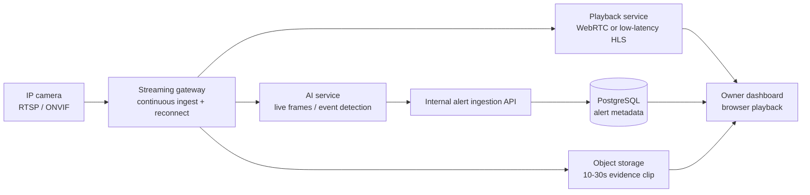

# Near-real-time camera streaming design

## Requirement

The system must consume a camera's live stream continuously. It is not a batch workflow that uploads and analyses historical recordings after an incident.

## Architecture

## Responsibilities

- **Streaming gateway**: opens and maintains each RTSP/ONVIF source, reconnects after disconnects, exposes health state and produces a browser-safe playback stream.
- **AI service**: consumes live frames from the gateway and emits an event immediately when its rule/model triggers.
- **API**: stores alert metadata and evidence object keys; it does not proxy or store a camera's raw RTSP video stream.
- **Browser**: plays WebRTC or low-latency HLS only. Browsers do not reliably play RTSP, and camera credentials must never be exposed to them.

## Data and security boundary

`Camera.streamGatewayRef` is the database pointer to the gateway configuration. The real RTSP URL and camera username/password must be encrypted and managed by the streaming gateway or a secret manager, not stored in PostgreSQL or returned from a REST endpoint.

Each alert stores only the event timestamps and object-storage keys for its 10-30 second evidence clip. The clip begins before detection where the gateway supports a rolling buffer.

## Cashier-side person classification

For each cashier camera, the manager draws two calibrated polygons:

- **Inner counter**: people detected in this zone are labelled `EMPLOYEE`.
- **Outer counter**: people detected in this zone are labelled `CUSTOMER`.

The AI service emits the matching zone ID and person category with an event. If the camera angle is unclear or a person is outside both zones, it emits `UNKNOWN` rather than guessing. This enables employee-focused rules such as unusual cash-drawer access without using face recognition.

## Multiple cameras per store

Each camera is an independent live-stream source and has its own calibrated cashier polygons; zones from one angle must not be reused for another. If the AI observes the same physical incident from multiple cameras, it sends one `correlationId`. The API preserves a separate alert and evidence clip for each camera, while the dashboard can present them as one incident.

## API contract additions

These endpoints are designed now and will be implemented in task 3/6:

| Method | Path | Purpose |
| --- | --- | --- |
| POST | `/api/v1/stores/:storeId/cameras/:cameraId/connection-test` | Ask the gateway to validate camera connectivity without returning credentials. |
| GET | `/api/v1/stores/:storeId/cameras/:cameraId/stream-status` | Return `online`, `offline`, last frame time and reconnect state. |
| GET | `/api/v1/stores/:storeId/cameras/:cameraId/playback` | Return a short-lived, authorized WebRTC/HLS playback URL. |

The alert list remains metadata-only. A selected alert requests its authorized evidence playback URL separately.
